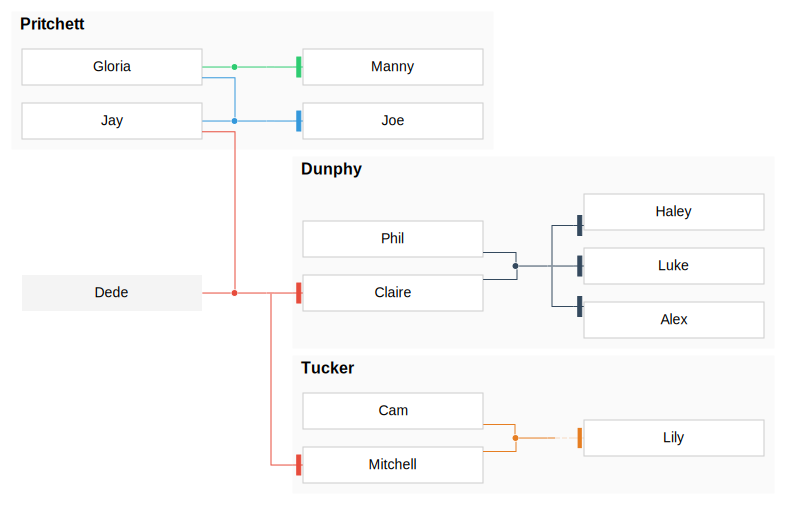

# kingraph_template
A template for plotting family trees using [kingraph](https://github.com/rstacruz/kingraph).

## Current family tree

### family.yml
This is a copy of [Modern Family](https://github.com/rstacruz/kingraph/blob/master/examples/modernfamily.yml), one of the rstacrz/kingraph examples

## How to use
1. Hit the "use this template" button and give your project a name
1. Replace content of README.md
1. Code your family in yaml  
   You can also add a new yaml file
1. Commit and push changes
1. CI runs automatically and updates the family tree

## Related links
- [kingraph](https://github.com/rstacruz/kingraph)
    - [Getting started](https://github.com/rstacruz/kingraph/blob/master/docs/getting_started.md)
    - [Advanced usage](https://github.com/rstacruz/kingraph/blob/master/docs/advanced.md)
    - [Schema](https://github.com/rstacruz/kingraph/blob/master/docs/schema.md)
    - [examples](https://github.com/rstacruz/kingraph/tree/master/examples)
